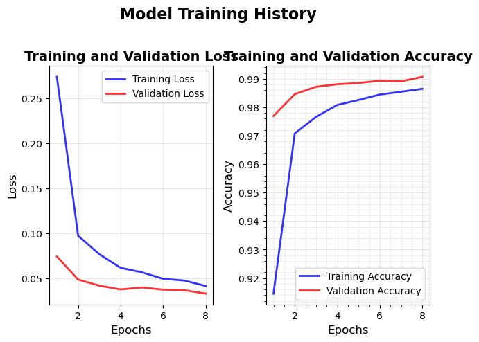
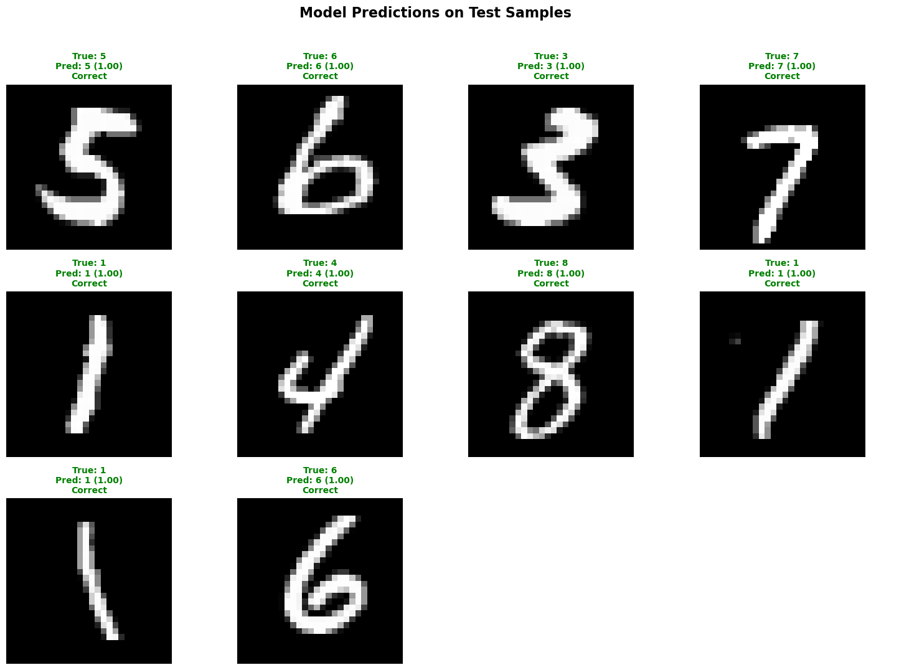

# Handwritten Digit Recognizer

## About this Project
This repo is an implementation of a Convolutional Neural Network (CNN) applied on handwritten digit recognition.
The model used was trained on the [MNIST](https://en.wikipedia.org/wiki/MNIST_database) dataset.

## Architecture
| Module | Layer # | Layer Type | Key Parameters | Input Shape | Output Shape |
|--------|---------|------------|----------------|-------------|--------------|
| **Feature Extractor** | 1 | `Conv2d` | `in_channels=1`, `out_channels=32`, `kernel_size=3`, `padding=1` | (1, 28, 28) | (32, 28, 28) |
| | 2 | `ReLU` | - | (32, 28, 28) | (32, 28, 28) |
| | 3 | `MaxPool2d` | `kernel_size=2`, `stride=2` | (32, 28, 28) | (32, 14, 14) |
| | 4 | `Dropout2d` | `p=0.25` | (32, 14, 14) | (32, 14, 14) |
| | 5 | `Conv2d` | `in_channels=32`, `out_channels=64`, `kernel_size=3`, `padding=1` | (32, 14, 14) | (64, 14, 14) |
| | 6 | `ReLU` | - | (64, 14, 14) | (64, 14, 14) |
| | 7 | `MaxPool2d` | `kernel_size=2`, `stride=2` | (64, 14, 14) | (64, 7, 7) |
| | 8 | `Dropout2d` | `p=0.25` | (64, 7, 7) | (64, 7, 7) |
| | 9 | `Flatten` | - | (64, 7, 7) | (3136,) |
| **Classifier** | 1 | `Dropout` | `p=0.25` | (3136,) | (3136,) |
| | 2 | `Linear` | `in_features=3136`, `out_features=128` | (3136,) | (128,) |
| | 3 | `ReLU` | - | (128,) | (128,) |
| | 4 | `Dropout` | `p=0.25` | (128,) | (128,) |
| | 5 | `Linear` | `in_features=128`, `out_features=num_classes` | (128,) | (10,) |

During test time, the output logits from the final linear layer will be passed through a Softmax classifier layer to obtain prediction probabilities.

## Results
The final validation accuracy was around 99.07%, and test accuracy around 99.24%.
All training logs and results can be viewed inside the [demo notebook](demo.ipynb).

Some examples of test-time inference are shown below. 
The number in brackets for each sample represents the predicted probability.
 